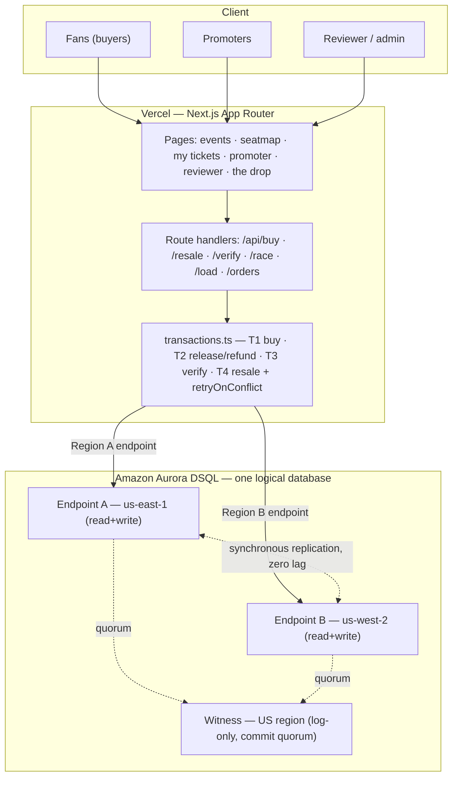

# Architecture

Next.js (App Router) on Vercel → serverless route handlers → **Amazon Aurora
DSQL** multi-region cluster, exposing **two strongly-consistent regional
endpoints** plus a **witness region**. Fans on either endpoint read and write one
logical database with no replication lag.

A static version is in [`architecture.svg`](architecture.svg).

## Why DSQL (the deliberate-choice answer)

Fair allocation of scarce things needs **SQL-shaped transactional invariants**
(decrement inventory + hold escrow + check the verified-fan gate, atomically)
**and** **active-active multi-region strong consistency** (a global on-sale where
both endpoints read one truth). Standard Aurora gives the SQL but not
active-active multi-region writes; DynamoDB gives scale but makes multi-item
transactional invariants awkward. **DSQL gives both** — the sweet spot for a
flash-drop that cannot oversell.

## DSQL is not vanilla Postgres — the facts that shaped this code

### Optimistic concurrency control (the core of the demo)
- Lock-free OCC, **snapshot isolation fixed at `REPEATABLE READ`** (cannot be changed).
- Conflicts rejected **at `COMMIT`** as **`SQLSTATE 40001`** with an OCC sub-code:
  `OC000` (data conflict — two txns modified the same row) or `OC001` (schema conflict).
- Every write flows through [`retryOnConflict`](../src/db/retry.ts) with full-jitter
  backoff, tuned for flash-drop contention (`maxAttempts=12, base=2, max=60`).
  Transactions are idempotent so a retry is safe.

### `SELECT … FOR UPDATE` is a no-op
- DSQL accepts it but **does not lock** under OCC. Correctness must come from the
  **write**, not the lock. We use plain `SELECT`s and rely on the contended
  `UPDATE` — a stock **bucket** (T1), the **escrow account** (T2), or the **ticket
  capability row** (T4) — to create the write-write conflict DSQL arbitrates at
  commit. (The local `postgres` backend uses `SERIALIZABLE` to raise the same `40001`.)

### Snapshot isolation permits write skew — contend on the shared row
The naive buy path "checks" availability with `SELECT count(*) FROM orders WHERE
section_id = …` then `INSERT`s a new order — two concurrent buyers both read `0`,
both insert *different* rows, and **oversell**, because nothing conflicts. This is
a textbook write skew snapshot isolation allows, and it reproduces **even on real
DSQL** (intermittently, depending on commit timing; reliably on the in-process
engine). The fix — the guarded path — **takes a seat from a shared stock bucket**,
making the contention visible so OCC rejects the loser at commit. The lesson: on
an OCC/snapshot database you must write the contested row to get protection.

### Sharded inventory — surviving a real drop
A single hot seat counter is a hot spot under OCC: every buy contends on one row,
so a stampede drowns in `40001` retries and sheds buyers. Inventory is therefore
**sharded** into N `section_stock_buckets` rows; T1 takes from a *randomly chosen*
bucket (`takeFromBucket`) and `SUM(remaining_count)` is the seats left. Conflict
probability drops ~1/N, so throughput scales with bucket count while the
zero-oversell guarantee is unchanged. Order of operations is deliberate:
**(1) shard** (the real fix), **(2) tune retry**, **(3) HTTP backoff**. The
[`load`](../scripts/load-test.ts) harness measures it: 1 bucket collapses and
sheds buyers; 64 buckets serve them all at ~10× throughput, zero oversell.

### No SERIAL / sequences → client-generated UUIDv7
Client-side **UUIDv7** ([`src/lib/uuidv7.ts`](../src/lib/uuidv7.ts)): millisecond
prefix for index locality + randomness to spread writes across the keyspace and
avoid hot-key contention. No assumption of `gen_random_uuid()`.

### Unsupported features → integrity in app transactions
- No FK / triggers / PL-pgSQL. Referential integrity + cascades live in T1–T4.
- No `CHECK` assumed: "`remaining_count`/`held_cents` never below 0" and the
  enum-valued `status`/`state`/`tier` columns are enforced in the transactions.
- Only `PRIMARY KEY` / `NOT NULL` / `UNIQUE`. Indexes via `CREATE INDEX ASYNC`
  (`sections(event_id)`, `orders(buyer_id|event_id|section_id|idempotency_key)`,
  `tickets(holder_user_id|section_id|event_id)`, `verifications(subject_id)`).
- Limits respected: 3,000 row-mods / 10 MiB / 5-min per transaction; one DDL per
  transaction; ~60-min connection lifetime (pool recycles ~50 min; IAM token
  refreshed per new connection via the async `password` function).

## Multi-region: be precise

- Two regional endpoints, both **read-write with strong consistency** via
  synchronous cross-region replication (active-active, zero lag on commit).
- A **witness region** is **log-only** (no endpoint); it joins the commit quorum
  so a single-region failure still commits with no data loss.
- **Same-continent only today.** The validated cluster here is **`us-east-1` +
  `us-west-2`** (both US) with a US witness. Cross-continent peering is not
  supported as of mid-2026; the design generalizes as DSQL's region matrix grows.

> Why active-active isn't over-engineering for ticketing: a global on-sale draws
> fans worldwide at the same instant against **one** seat ledger that must not
> diverge — exactly DSQL's two-endpoint model — plus regional failover.

## Connection & auth

`postgres.js` + IAM tokens (`@aws-sdk/dsql-signer`), see [`src/db/dsql.ts`](../src/db/dsql.ts):
`password` is an async function so a fresh token is minted per new physical
connection; `ssl: require`; `max_lifetime ≈ 50 min`; `search_path = verdict`.

## Guarantees stated precisely (for the skeptical judge)

- **Strong consistency = allocation correctness:** a seat/ticket never sells to
  two people; both endpoints read identical final state after a stampede.
- **Inventory display counts** are read-after-write at an endpoint and eventually
  consistent across regions by milliseconds during a burst — acceptable for a
  fair drop. We narrate this distinction rather than claiming "zero lag everywhere."
- **Tier read-skew (documented guarantee):** T1 reads the fan tier at transaction
  start; an in-flight order honors the tier as of its start, and a new order
  honors a newly-revoked tier. Revocation does not retroactively kill in-flight
  holds (Option B); strict revocation is a named next step.
- **Reconciliation invariant:** `held_cents + Σrelease + Σrefund = Σhold` per
  order, asserted in the order timeline UI, the race report, and the tests; it
  holds identically read from either endpoint.
