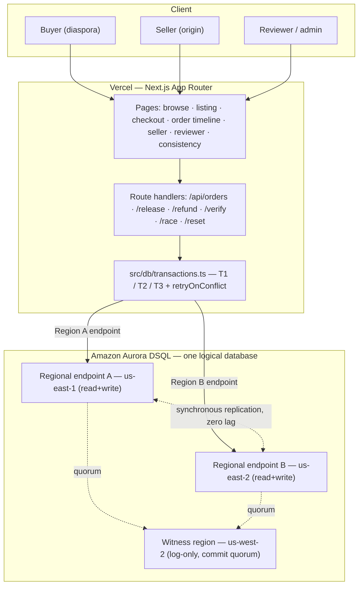

# Architecture

Next.js (App Router) on Vercel → serverless route handlers → **Amazon Aurora
DSQL** multi-region cluster. The cluster exposes **two strongly-consistent
regional endpoints** plus a **witness region**. Region A serves the buyer
geography, Region B serves the seller geography; either endpoint reads and writes
the same data with no replication lag.



A static version is in [`architecture.svg`](architecture.svg).

---

## Why DSQL (the deliberate-choice answer)

The product needs **SQL-shaped transactional invariants** (inventory + escrow +
verification, atomic together) **and** **active-active multi-region strong
consistency** so a buyer in one region and a seller in another read one truth.

- **Standard Aurora** gives the SQL but not active-active multi-region writes.
- **DynamoDB** gives the scale but pushes multi-item transactional invariants
  into awkward territory.
- **Aurora DSQL** gives both — which is exactly why the inventory-and-escrow
  consistency story is its sweet spot.

---

## DSQL is not vanilla Postgres — the facts that shaped this code

All verified against AWS documentation (June 2026). These drove concrete
decisions, not just comments.

### Optimistic concurrency control (the core of the demo)
- DSQL is **lock-free OCC** with **snapshot isolation**, isolation level fixed at
  **`REPEATABLE READ`** (you cannot `SET SERIALIZABLE`).
- Conflicts are detected and rejected **at `COMMIT`**, surfaced as **`SQLSTATE
  40001`** with an OCC sub-code:
  - `OC000` — *data conflict* (two transactions modified the same row; earliest
    commit wins).
  - `OC001` — *schema conflict* (concurrent DDL invalidated a cached catalog).
- **Implication:** retry is not optional. Every write path flows through
  [`retryOnConflict`](../src/db/retry.ts) with exponential **full-jitter**
  backoff, and transactions are written to be **idempotent** so a retry is safe.

### `SELECT ... FOR UPDATE` is a no-op
- DSQL accepts `FOR UPDATE` syntactically but **does not lock** — there is no
  pessimistic row locking under OCC.
- **Implication:** correctness must come from the **write**, not the lock. In T1
  we read the listing with a plain `SELECT` and rely on the contended
  `UPDATE listings SET inventory_count = inventory_count - $qty` to create the
  write-write conflict DSQL arbitrates at commit. Relying on `FOR UPDATE` here
  would be a silent correctness bug. (For the local `postgres` backend we set
  `SERIALIZABLE`, which raises the same `40001` from the read-write dependency.)

### Snapshot isolation permits write skew — contend on the shared row
DSQL's isolation is **snapshot (REPEATABLE READ)**, not serializable. Snapshot
isolation **permits write skew**: two transactions that read a *predicate* and
write *different* rows never conflict. We demonstrate this honestly — the naive
order path "checks" availability with `SELECT count(*) FROM orders WHERE
listing_id = …` and then `INSERT`s a new order. Two concurrent naive orders both
read `0`, both insert different rows, and **oversell — intermittently, even on
real DSQL** (confirmed live via `npm run smoke:dsql`; the window depends on commit
timing).
- **Implication / the fix:** the guarded path (T1) decrements the **shared
  listing row**. That makes the contention visible to the engine, turning the
  race into a write-write conflict DSQL rejects at commit (`40001`). The lesson:
  on an OCC/snapshot database you must write the contested row to get protection;
  reading a predicate and writing elsewhere is not enough. The guarded path
  oversells **zero** times across thousands of runs (see the test suite).

### No SERIAL / sequences → client-generated UUIDv7
- DSQL has no `SERIAL`; AWS recommends application-generated UUID keys, both for
  compatibility and to **spread writes across the keyspace** (monotonic keys
  create hot spots and OCC contention).
- We mint **UUIDv7** client-side ([`src/lib/uuidv7.ts`](../src/lib/uuidv7.ts)):
  a 48-bit millisecond prefix (good index locality) + randomness, with a
  per-millisecond monotonic counter for in-order generation. We do **not** assume
  `gen_random_uuid()` exists.

### Unsupported features → integrity in app transactions
- **No foreign keys, triggers, views-as-integrity, stored procedures / PL/pgSQL.**
  Referential integrity and cascades live in T1/T2/T3.
- **No `CHECK` constraints assumed.** "`inventory_count` never below 0",
  "`held_cents` never below 0", and the enum-valued `status`/`state`/`tier`
  columns are all enforced inside the transactions, not by the schema.
- **Only `PRIMARY KEY`, `NOT NULL`, `UNIQUE`** are used (see
  [`schema.sql`](../src/db/schema.sql)).

### Non-blocking index builds
- `CREATE INDEX ASYNC` returns a `job_id` immediately and builds in the
  background (status via `SELECT * FROM sys.jobs WHERE job_id = …`). The schema
  uses it for `listings(seller_id)`, `orders(buyer_id|listing_id|seller_id)`,
  `escrow_entries(order_id)`, `verifications(seller_id)`. The local `postgres`
  backend rewrites `INDEX ASYNC` → `INDEX` at apply time.

### Transaction & connection limits
- ~**3,000 row modifications** / **10 MiB** / **5-minute** maximum per
  transaction; **one DDL statement per transaction**; **no mixing DDL and DML**.
  The schema is applied one statement at a time; T1/T2/T3 touch a handful of rows.
- Connections have a hard **~60-minute lifetime**. The pool sets
  `max_lifetime ≈ 50 min`; because the postgres.js `password` is an **async
  function**, a fresh IAM token is minted on every new physical connection, so
  token refresh on reconnect is automatic.

---

## Multi-region: be precise on camera

- A multi-region DSQL cluster exposes **two regional endpoints**, both
  **read-write with strong consistency** via synchronous cross-region
  replication (active-active, zero replication lag on commit).
- A third **witness region** is **log-only** (no endpoint); it participates in the
  commit quorum so that if one active region fails, the remaining active region +
  witness still form a majority and commits continue with no data loss.
- **Region pairing is same-continent only today.** The canonical, currently-
  supported example used here is **`us-east-1` + `us-east-2`** with a
  **`us-west-2`** witness. Cross-continent peering (e.g. `us-east-1` + `eu-west-1`)
  is **not** supported as of mid-2026, and witness regions are US-based — so we
  use US regions as stand-ins for the buyer/seller geographies and say so. The
  architecture **generalizes** to an African region (e.g. `af-south-1`) as DSQL's
  multi-region coverage expands; we do not claim an endpoint we don't have.

> Why active-active here isn't over-engineering: a buyer and a seller on different
> continents transact against **one** escrow ledger that cannot diverge — which is
> precisely DSQL's two-endpoint model.

---

## Connection & auth

`postgres.js` with **IAM-generated auth tokens** (`@aws-sdk/dsql-signer`,
`DsqlSigner`). See [`src/db/dsql.ts`](../src/db/dsql.ts):

```ts
const signer = new DsqlSigner({ hostname, region, expiresIn });
postgres({
  host, port: 5432, database: "postgres", username: "admin",
  password: async () => signer.getDbConnectAdminAuthToken(), // fresh per connection
  ssl: "require",                 // DSQL rejects non-TLS
  max_lifetime: 60 * 50,          // recycle before the 60-min cap
  connection: { search_path: "dhamana" },
  prepare: false,
});
```

---

## The reconciliation invariant

For every order: **`held_cents + Σ release + Σ refund = Σ hold`**. Computed in
[`reconcile()`](../src/db/transactions.ts) and asserted in the order timeline UI,
the race report, and the test suite. It holds identically read from either
regional endpoint — that identical reconciliation across endpoints **is** the
strong-consistency guarantee made tangible.
